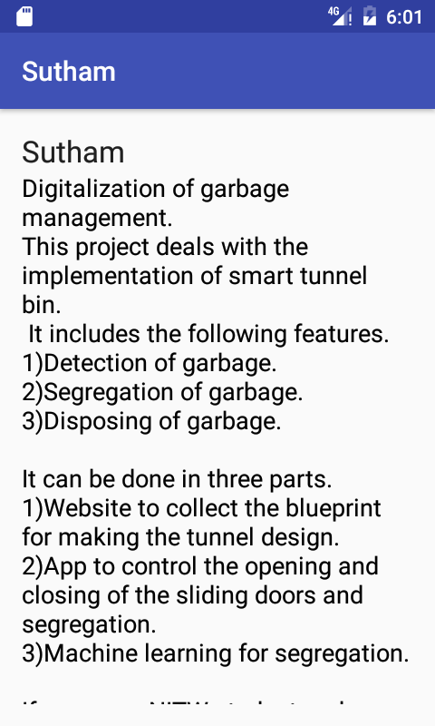
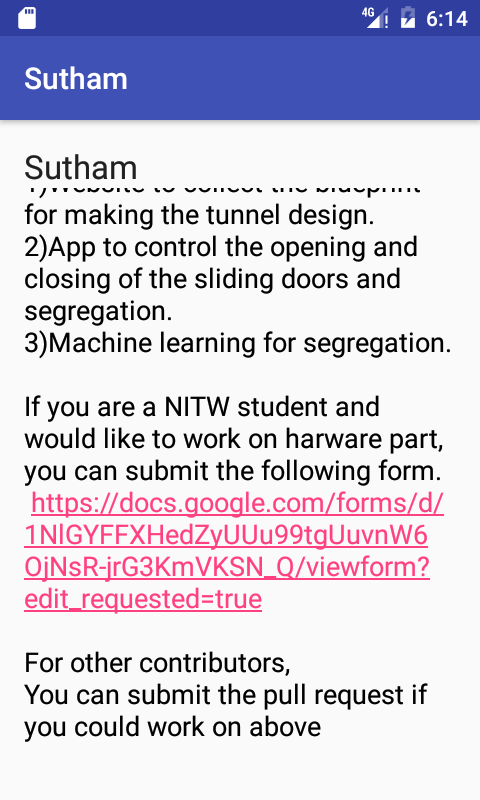

# Sutham Android App
Digitalization of garbage management

This project deals with the implementation of smart tunnel bin.It includes the following features.

1.Detection of garbage
2.Segregation of garbage
3.Disposing of garbage

It can be done in three parts.

1.Website to collect the blueprint for making the tunnel design.
2.App to control the opening and closing of the sliding doors and segregation.
3.Machine learning for segregation.

If you are a NITW student and would like to work on harware part, you can submit the following form.

https://docs.google.com/forms/d/1NlGYFFXHedZyUUu99tgUuvnW6OjNsR-jrG3KmVKSN_Q/viewform?edit_requested=true

For other contributors,

You can submit the pull request if you could work on above.

